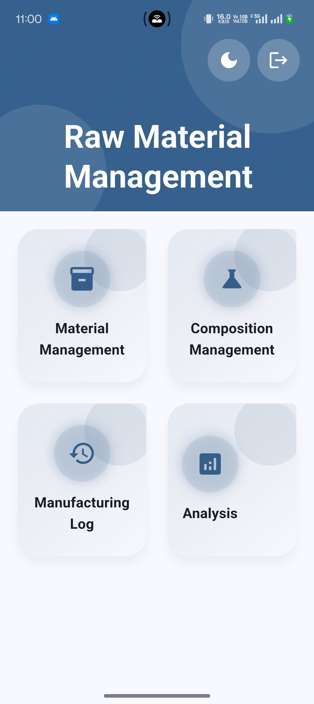
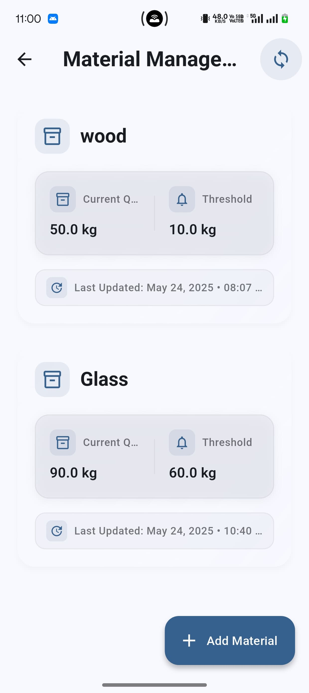
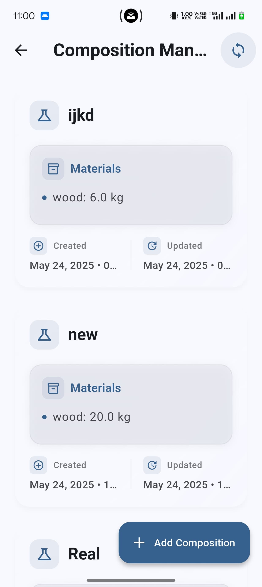
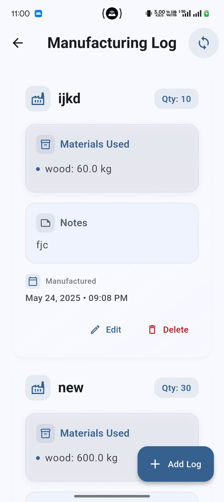
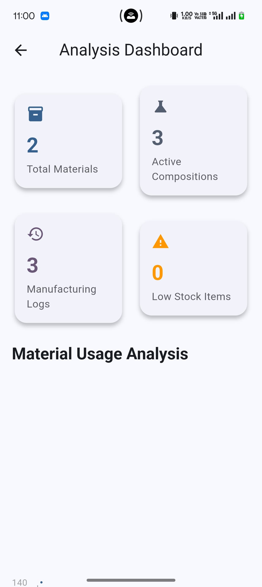
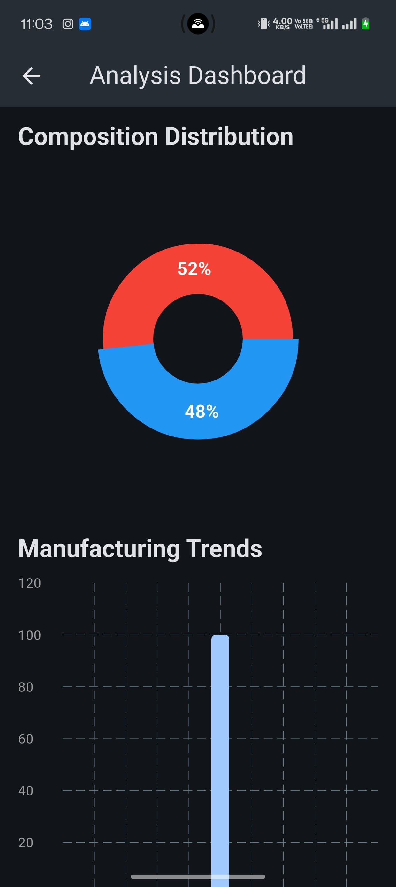

# Raw Material Management

A Flutter application for managing raw materials, compositions, manufacturing processes, and analytics.

## Setup Instructions

1. **Prerequisites**
   - Flutter SDK (latest stable version)
   - Dart SDK (latest stable version)
   - Android Studio / VS Code with Flutter extensions
   - Git

2. **Installation**
   ```bash
   # Clone the repository
   git clone https://github.com/yourusername/raw_material_management.git

   # Navigate to project directory
   cd raw_material_management

   # Get dependencies
   flutter pub get

   # Run the app
   flutter run
   ```

3. **Environment Setup**
   - Ensure you have the correct Flutter environment variables set
   - For iOS development, ensure you have Xcode installed
   - For Android development, ensure you have Android Studio and SDK installed

## Architecture Overview

The application follows a clean architecture pattern with the following structure:

```
lib/
├── core/
│   ├── theme/
│   └── utils/
├── features/
│   ├── home/
│   ├── inventory/
│   ├── composition/
│   ├── manufacturing/
│   └── analysis/
└── main.dart
```

### Key Components:
- **Core**: Contains shared utilities, theme configurations, and common widgets
- **Features**: Each feature is organized in its own directory with:
  - Presentation (UI)
  - Domain (Business Logic)
  - Data (Repository Implementation)

### State Management:
- Uses BLoC pattern for state management
- Implements clean architecture principles
- Follows SOLID principles

## Demo

### Screenshots

#### Home Screen


#### Material Management


#### Composition Management


#### Manufacturing Log


#### Analysis


#### Additional Features


### Features Demo
1. **Material Management**
   - Inventory tracking
   - Stock management
   - Material categorization

2. **Composition Management**
   - Create material compositions
   - Manage recipes
   - Track composition changes

3. **Manufacturing Log**
   - Process tracking
   - Production history
   - Quality control

4. **Analysis**
   - Usage analytics
   - Cost analysis
   - Performance metrics

## Contributing

Contributions are welcome! Please feel free to submit a Pull Request.

## License

This project is licensed under the MIT License - see the LICENSE file for details.
